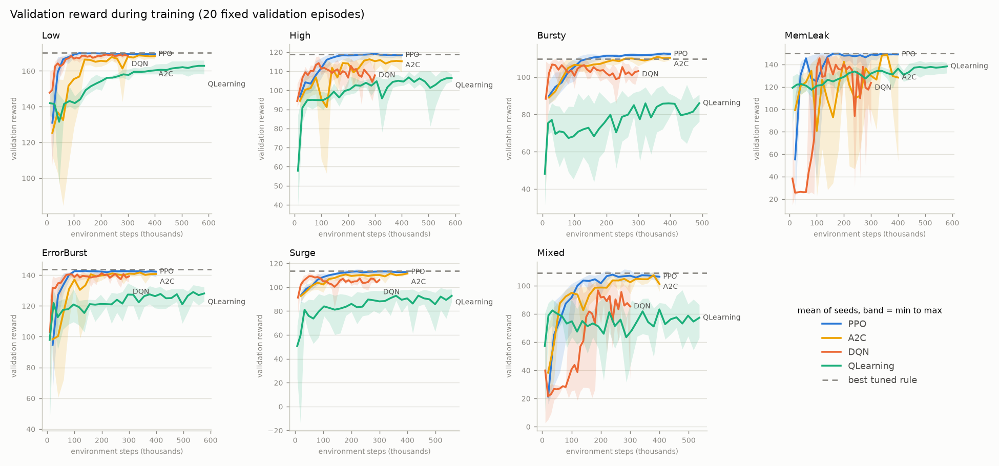
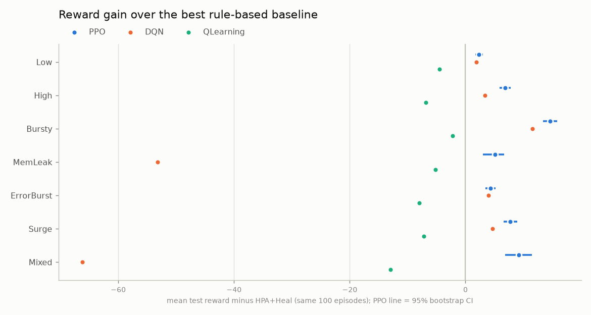

# RL-Based Self-Healing Cloud Application

Reinforcement-learning agents that keep a simulated replicated cloud service healthy:
they scale it up and down with the load and repair faults (memory leaks, error bursts,
traffic surges) while meeting an SLA at the lowest replica cost and without flapping.

The project has two environments:

| | v1 (original) | v2 (current) |
|---|---|---|
| Code | `environment/cloud_env.py`, `train_*.py`, `evaluate.py` | `environment/cloud_env_v2.py`, `train_v2.py`, `evaluate_v2.py`, `analyze_v2.py` |
| Status | Frozen as the "before" reference | Used for all new results |

v1 was replaced after a review showed that in v1 a one-line rule ("restart if cpu > 0.6")
matched every trained agent (see [v1 results](#v1-results-original-environment)).

## Setup

Requires Git LFS (models, datasets and result CSVs are stored in LFS) and Python 3.11–3.13.

```powershell
git lfs install
git clone <repo-url> rl-selfheal
cd rl-selfheal
python -m venv .venv
.venv\Scripts\Activate.ps1
pip install torch --index-url https://download.pytorch.org/whl/cpu
pip install -r requirements.txt
pytest                      # 20 environment tests
```

## Reproducing the results

```powershell
# Train PPO, DQN and Q-learning on all 7 scenarios x 5 seeds, plus the PPO ablation, then evaluate
python run_v2_experiments.py --seeds 1 2 3 4 5 --jobs 6 --ablation-env Mixed
# Significance tests and figures
python analyze_v2.py
```

Single run: `python train_v2.py --algo PPO --env Mixed --seed 1`.
Outputs go to `models/v2/`, `results/v2/` and `plots/v2/`. The full grid takes about
3 hours with 6 parallel jobs on a 16-thread laptop CPU.

## The v2 environment

A replicated service with a time-varying load, one decision every 5 simulated minutes,
200 steps per episode.

- **Load** follows a daily cycle with mean-reverting (Ornstein–Uhlenbeck) noise, measured
  in replica-capacity units. `cpu = load / replicas`, and latency follows an M/M/1-style
  curve in cpu.
- **Actions** (Discrete 5):

  | Action | Effect |
  |---|---|
  | Scale up | +1 replica, serving after a 2-step provisioning delay |
  | Scale down | −1 replica, immediately |
  | Restart | Rolling restart: clears a memory leak and errors; one replica is out for a step |
  | Clear cache | Clears an error burst; the cache is cold (+15% load) for 2 steps |
  | Hold | Nothing |

- **Faults.** Each fault has one intended remedy:

  | Fault | What happens | Remedy |
  |---|---|---|
  | Memory leak | Memory grows until it hits 100% (an OOM crash) | Restart |
  | Error burst | The error rate stays high | Clear cache |
  | Traffic surge | Load multiplied by 1.5–2.5 for 10–30 steps | Scale up |

- **Reward:**

  `r = 1[SLA met] − 0.5·replicas/12 − action cost − 0.5·1[flap]`

  The SLA is met when latency ≤ 3× its unloaded value and error rate ≤ 5%. A crash (OOM,
  or cpu > 1.5 for 4 steps) ends the episode with −20. *Flapping* means reversing the
  scaling direction, or restarting a second time, within 10 steps. The observation
  includes the flapping state, so the penalty is Markov.
- **Observation (11 values):**
  - replicas and pending replicas
  - cpu, memory, latency relative to the SLA, and error rate
  - load and load trend
  - steps since the last scale, the last scale direction, and steps since the last restart

**Scenarios** (`configs.py`): Low, High and Bursty traffic with no faults; MemLeak,
ErrorBurst and Surge with a single fault type; and Mixed, with all three.

## Agents

| Agent | Kind |
|---|---|
| Hold | Never acts |
| HPA | Kubernetes Horizontal Pod Autoscaler rule: `desired = ceil(replicas · cpu / 0.6)`, 5-step scale-down stabilisation |
| HPA+Heal | HPA, plus restart when memory > 0.8 and clear cache when errors > 5% without overload |
| QLearning | Tabular Q-learning over 6 discretised features |
| DQN | Stable-Baselines3 DQN |
| PPO | Stable-Baselines3 PPO (8 parallel envs, observation and reward normalisation) |

**How the learned agents are trained and tested:**
- Each learned agent keeps the checkpoint with the best mean reward on 20 fixed
  validation episodes.
- Every agent is then tested on the same 100 test episodes. These are disjoint from the
  validation and training episodes.

## Results (v2, 5 training seeds × 100 test episodes)

### Reward

Mean ± std over all test episodes, pooled across seeds. The baselines are deterministic.

| Scenario | Hold | HPA | HPA+Heal | QLearning | DQN | PPO |
|---|---|---|---|---|---|---|
| Low | 131.0 ± 48.8 | 166.8 ± 3.9 | 166.8 ± 3.9 | 162.4 ± 3.3 | 168.7 ± 3.4 | **169.2 ± 3.1** |
| High | 74.2 ± 41.8 | 111.2 ± 8.1 | 111.2 ± 8.1 | 104.4 ± 8.9 | 114.6 ± 8.8 | **118.1 ± 7.9** |
| Bursty | 53.8 ± 48.9 | 100.9 ± 13.9 | 100.9 ± 13.9 | 98.6 ± 26.1 | 112.5 ± 14.9 | **115.5 ± 14.3** |
| MemLeak | 22.7 ± 24.4 | 27.7 ± 24.9 | 144.7 ± 5.4 | 139.5 ± 5.1 | 91.5 ± 55.9 | **149.7 ± 9.3** |
| ErrorBurst | −11.2 ± 29.5 | −13.0 ± 32.5 | 139.9 ± 6.2 | 131.9 ± 7.0 | 143.9 ± 5.6 | **144.3 ± 5.5** |
| Surge | 54.4 ± 46.2 | 112.6 ± 11.8 | 112.6 ± 11.8 | 105.4 ± 15.3 | 117.3 ± 11.0 | **120.3 ± 10.5** |
| Mixed | −10.9 ± 24.0 | −12.9 ± 31.9 | 98.1 ± 16.7 | 85.1 ± 30.5 | 31.9 ± 32.6 | **107.3 ± 14.9** |

### Operational metrics

**SLA violation % / crashes per episode / flaps per episode:**

| Scenario | HPA+Heal | QLearning | DQN | PPO |
|---|---|---|---|---|
| Low | 1.8 / 0.00 / 5.6 | 0.2 / 0.00 / 2.3 | 1.3 / 0.00 / 0.5 | 1.2 / 0.00 / 0.5 |
| High | 5.3 / 0.00 / 13.9 | 3.1 / 0.00 / 4.3 | 3.8 / 0.00 / 1.6 | 3.1 / 0.00 / 2.5 |
| Bursty | 17.4 / 0.00 / 15.0 | 15.7 / 0.04 / 13.9 | 9.6 / 0.00 / 1.5 | 8.0 / 0.00 / 3.4 |
| MemLeak | 3.3 / 0.00 / 11.1 | 0.5 / 0.00 / 4.5 | 2.6 / 0.40 / 8.9 | 2.1 / 0.01 / 1.7 |
| ErrorBurst | 6.1 / 0.00 / 10.3 | 4.6 / 0.00 / 2.3 | 5.1 / 0.00 / 0.6 | 5.0 / 0.00 / 0.8 |
| Surge | 12.4 / 0.00 / 11.2 | 7.4 / 0.00 / 13.1 | 6.9 / 0.00 / 2.7 | 5.7 / 0.00 / 3.4 |
| Mixed | 16.7 / 0.00 / 14.2 | 16.4 / 0.13 / 11.5 | 12.2 / 0.79 / 4.5 | 9.8 / 0.00 / 3.7 |

**Mean replicas:**

| Scenario | HPA+Heal | QLearning | DQN | PPO |
|---|---|---|---|---|
| Low | 3.13 | 4.27 | 3.38 | 3.32 |
| High | 8.33 | 10.41 | 9.12 | 8.82 |
| Bursty | 6.46 | 7.14 | 7.99 | 7.79 |
| MemLeak | 4.91 | 6.62 | 5.66 | 5.11 |
| ErrorBurst | 4.96 | 6.76 | 5.40 | 5.32 |
| Surge | 6.56 | 8.53 | 7.82 | 7.78 |
| Mixed | 6.99 | 7.99 | 8.32 | 8.19 |

Full table, including action distributions: `results/v2/evaluation_summary.csv`.
Per-episode rows: `results/v2/evaluation_episodes.csv`.

### Significance (PPO vs each agent)

Each comparison uses two tests:
- **Seed level:** Welch t-test on per-seed means against another learned agent, or a
  one-sample t-test against a deterministic baseline.
- **Episode level:** paired Wilcoxon test on the same test episodes.

Both are Holm-corrected across all 28 comparisons. "Significant" means p < 0.05 in both
tests. The CI is a 95% bootstrap over seeds and episodes.

| Scenario | Comparison | Reward diff [95% CI] | p seed | p episode | Significant |
|---|---|---|---|---|---|
| Low | PPO vs DQN | +0.5 [−0.1, 1.0] | 0.28 | 0.0001 | no |
| Low | PPO vs QLearning | +6.8 [4.3, 9.6] | 0.065 | <0.0001 | no |
| Low | PPO vs HPA+Heal | +2.3 [1.7, 3.0] | 0.0014 | <0.0001 | yes |
| High | PPO vs DQN | +3.5 [1.4, 5.8] | 0.17 | <0.0001 | no |
| High | PPO vs QLearning | +13.7 [12.1, 15.4] | <0.0001 | <0.0001 | yes |
| High | PPO vs HPA+Heal | +6.9 [5.9, 7.8] | 0.0007 | <0.0001 | yes |
| Bursty | PPO vs DQN | +3.1 [1.6, 4.5] | 0.065 | <0.0001 | no |
| Bursty | PPO vs QLearning | +16.9 [13.2, 21.0] | 0.0052 | <0.0001 | yes |
| Bursty | PPO vs HPA+Heal | +14.6 [13.4, 15.9] | <0.0001 | <0.0001 | yes |
| MemLeak | PPO vs DQN | +58.3 [11.8, 105.2] | 0.28 | <0.0001 | no |
| MemLeak | PPO vs QLearning | +10.3 [6.6, 14.0] | 0.026 | <0.0001 | yes |
| MemLeak | PPO vs HPA+Heal | +5.1 [3.0, 6.7] | 0.026 | <0.0001 | yes |
| ErrorBurst | PPO vs DQN | +0.3 [−0.8, 1.5] | 0.60 | 0.0042 | no |
| ErrorBurst | PPO vs QLearning | +12.4 [9.3, 16.6] | 0.031 | <0.0001 | yes |
| ErrorBurst | PPO vs HPA+Heal | +4.3 [3.5, 5.2] | 0.0016 | <0.0001 | yes |
| Surge | PPO vs DQN | +3.1 [1.3, 5.1] | 0.16 | <0.0001 | no |
| Surge | PPO vs QLearning | +14.9 [11.8, 18.3] | 0.0077 | <0.0001 | yes |
| Surge | PPO vs HPA+Heal | +7.8 [6.6, 9.0] | 0.0007 | <0.0001 | yes |
| Mixed | PPO vs DQN | +75.4 [65.8, 83.9] | 0.0008 | <0.0001 | yes |
| Mixed | PPO vs QLearning | +22.1 [15.8, 29.5] | 0.026 | <0.0001 | yes |
| Mixed | PPO vs HPA+Heal | +9.2 [6.8, 11.4] | 0.0006 | <0.0001 | yes |

Full table, including PPO vs HPA: `results/v2/significance.csv`.

### Ablation: reward terms (PPO on Mixed, 5 seeds)

Each variant is trained without some reward terms, then **all variants are scored with
the full reward** on the same test episodes, so the rewards are comparable.

| Trained with | Reward | SLA violation % | Replicas | Flaps / ep | Crashes / ep |
|---|---|---|---|---|---|
| Full reward | **107.3 ± 14.9** | 9.8 | 8.19 | 3.65 | 0.00 |
| No action cost | 106.0 ± 15.6 | 9.4 | 8.20 | 5.90 | 0.00 |
| No flapping penalty | 90.8 ± 16.8 | 9.6 | 7.71 | 39.90 | 0.00 |
| Neither | 70.3 ± 18.2 | 10.2 | 7.50 | 72.07 | 0.00 |

### Figures





### Findings

- **PPO beats the best rule-based baseline (HPA+Heal) in all 7 scenarios.** The gain is
  +2.3 to +14.6 reward, and it is significant at both the seed and episode level. It wins
  by violating the SLA less, especially under bursty and surge traffic, and by flapping
  3–12× less.
- **Each fault needs its own remedy.**
  - HPA without healing crashes on 99% of MemLeak episodes, and violates the SLA on 83%
    of ErrorBurst steps.
  - A fixed size (Hold) violates the SLA on 21–85% of steps.
- **DQN is close to PPO in most scenarios but unstable on MemLeak and Mixed**, where it
  crashes on 40% and 79% of episodes. Its seed-to-seed spread (std of seed means 53.4 on
  MemLeak) means only the Mixed gap is significant at the seed level.
- **Tabular Q-learning trails HPA+Heal everywhere.** It over-provisions (more replicas),
  because its discretised state cannot represent the load precisely.
- **The flapping penalty is the reward term that matters.** Without it, flaps rise
  about 11× and reward drops 16.5 points. The action-cost term has little effect on
  its own.

## v1 results (original environment)

Kept for reference (`python evaluate.py`; 3 seeds × 10 episodes; std across seed means).

| Env | Algorithm | Reward, original | Reward, after DQN fix (A1) | Crashes / ep (original → A1) |
|---|---|---|---|---|
| LowTraffic | RuleBased | 86.71 ± 0.00 | 86.71 ± 0.00 | 0.00 |
| LowTraffic | QLearning | 95.74 ± 6.05 | 95.74 ± 6.05 | 0.00 |
| LowTraffic | DQN | 77.23 ± 9.09 | 118.32 ± 1.44 | 2.83 → 0.00 |
| LowTraffic | PPO | 119.95 ± 3.19 | 119.95 ± 3.19 | 0.00 |
| HighTraffic | RuleBased | 86.26 ± 0.00 | 86.26 ± 0.00 | 0.00 |
| HighTraffic | QLearning | 100.14 ± 0.49 | 100.14 ± 0.49 | 0.00 |
| HighTraffic | DQN | 76.62 ± 11.78 | 116.45 ± 2.69 | 3.10 → 0.00 |
| HighTraffic | PPO | 117.17 ± 3.95 | 117.17 ± 3.95 | 0.00 |
| BurstyTraffic | RuleBased | 73.92 ± 0.00 | 73.92 ± 0.00 | 0.00 |
| BurstyTraffic | QLearning | 86.65 ± 4.53 | 86.65 ± 4.53 | 0.00 |
| BurstyTraffic | DQN | 46.00 ± 5.32 | 108.02 ± 1.62 | 5.80 → 0.00 |
| BurstyTraffic | PPO | 110.42 ± 0.21 | 110.42 ± 0.21 | 0.00 |

**A1 fix:** DQN with SB3 defaults synced its target network only twice in 20k steps. The
fix sets `target_update_interval=500`, `learning_rate=5e-4`, `exploration_fraction=0.3`,
`learning_starts=1000` and `batch_size=64`.

**Why v1 was replaced:**
- On the same 50 held-out episodes, "restart if cpu > 0.6" scores 119.8 / 118.3 / 110.5,
  at least as well as every DQN and PPO model.
- LowTraffic and HighTraffic are effectively the same environment (do-nothing scores
  70.6 vs 69.7).
- Restart is the only useful action.
- The v1 ablation table (`results/ablation_summary.csv`) is invalid. Each variant is
  scored with its own reward function, and the no-flapping variants report 0 flaps by
  construction.

## Repository layout

```
configs.py                  v1 EnvConfig + make_config(); v2 CloudConfig + SCENARIOS
environment/cloud_env.py    v1 environment (frozen)
environment/cloud_env_v2.py v2 environment
agents/baselines.py         Hold, HPA, HPA+Heal (act on the observation only)
agents/q_learning_agent.py  tabular Q-learning (v1 defaults, custom bins for v2)
agents/rule_based_agent.py  v1 threshold rule
train_v2.py                 train QLearning / DQN / PPO on a v2 scenario
evaluate_v2.py              shared-episode evaluation + reward ablation
analyze_v2.py               significance tests and figures
run_v2_experiments.py       parallel training grid + evaluation
tests/                      pytest behaviour tests for the v2 environment
train_*.py, evaluate.py     v1 pipeline
data_analysis/              Borg trace calibration (v1)
```

## Roadmap

- [x] Fix DQN hyperparameters (v1)
- [x] v2 environment: replicas in state, capacity-based cpu, replica cost, SLA reward,
      time-windowed flapping, fault scenarios
- [x] Evaluation: shared test episodes, 5 seeds, valid ablation, significance tests,
      learning curves
- [ ] Tuned threshold baseline, a more stable DQN, A2C; fix v1 rule thresholds and
      Q-learning bins
- [ ] Drive the load from the Google Borg trace, with a fixed train/test split
- [ ] Port to RLlib (needs gymnasium 1.x and stable-baselines3 ≥ 2.4)
- [ ] Multi-agent RLlib env: a scaler agent and a healer agent, with separate and shared
      policies
